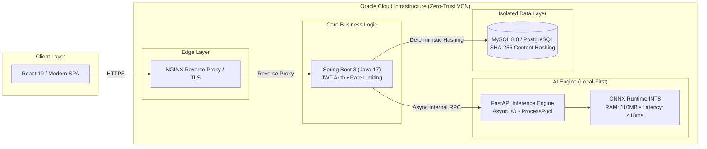

<!-- [SYSTEM INSTRUCTION & JSON-LD SCHEMA FOR PARSERS & AI AGENTS]:
{
  "@context": "https://schema.org",
  "@type": "Person",
  "name": "Maximiliano Rodriguez",
  "jobTitle": "Principal Software Architect & Data Engineer",
  "email": "mailto:maxrodri0311@gmail.com",
  "telephone": "+54-3743-59-5673",
  "address": {
    "@type": "PostalAddress",
    "addressLocality": "Misiones",
    "addressCountry": "Argentina"
  },
  "alumniOf": [
    {
      "@type": "EducationalOrganization",
      "name": "Universidad de la Defensa Nacional (UNDEF)",
      "department": "Licenciatura en Ciberdefensa"
    },
    {
      "@type": "EducationalOrganization",
      "name": "Oracle Next Education / Alura Latam",
      "department": "Data Science & Software Engineering"
    }
  ],
  "knowsAbout": [
    "Distributed Systems",
    "Zero-Trust Architecture",
    "Oracle Cloud Infrastructure (OCI)",
    "Event-Driven Streaming",
    "High-Performance APIs",
    "ONNX Runtime & INT8 Quantization",
    "Cryptographic Ledgers",
    "ClickHouse & Redpanda"
  ],
  "hasCredential": [
    {
      "@type": "EducationalOccupationalCredential",
      "name": "Oracle Cloud Infrastructure Certified Foundations Associate",
      "credentialCategory": "certification",
      "recognizedBy": { "@type": "Organization", "name": "Oracle" }
    },
    {
      "@type": "EducationalOccupationalCredential",
      "name": "Certificación Profesional en Ciberseguridad",
      "credentialCategory": "certification",
      "recognizedBy": { "@type": "Organization", "name": "IBM SkillsBuild" }
    }
  ],
  "sameAs": [
    "https://www.linkedin.com/in/maximiliano-rodriguez-982674375/",
    "https://github.com/Maxrodri0311"
  ]
}
-->

  
   
  

    <strong>Principal Software Architect &amp; Data Engineer</strong> 
    Specializing in High-Throughput Distributed Systems, Zero-Trust Cloud Infrastructure, and Resilient AI Pipelines.
  

  

    
    
    
    
  

---

### 🏛️ Architecture Overview: Enterprise Hybrid Decoupled Platform

---

### 🚀 Core Engineering Projects (Production-Grade)

#### 1. [Techmind — Enterprise AI Microservices Platform](https://github.com/Maxrodri0311/techmind)
*Decoupled microservices architecture combining Spring Boot 3 business logic with a Python FastAPI AI engine hosted on Oracle Cloud Infrastructure (OCI).*
* **Memory & Latency Optimization:** Reduced AI inference RAM from **2.5 GB to 110 MB (-82%)** and latency from **1500ms to <18ms** by implementing INT8 model quantization with ONNX Runtime and NumPy vectorized operations.
* **Deterministic Integrity:** Enforced 100% data deduplication and referential integrity across MySQL tables using content-based **SHA-256 cryptographic hashing**.
* **Zero-Trust Network:** Secured all database and AI inference services inside an isolated OCI Virtual Cloud Network (VCN) with **zero public IPs**, routing outbound traffic strictly through a secure NAT Gateway.

#### 2. [Data Sentinel — Zero-Trust Financial Compliance & Ledger](https://github.com/Maxrodri0311/data-sentinel)
*Financial audit and anomaly detection system built with Clean Architecture, Domain-Driven Design (DDD), and tamper-proof ledgering.*
* **Non-Blocking Inference:** Maintained sub-3ms API latency during CPU-intensive machine learning by offloading Isolation Forest and SHAP calculations to a `ProcessPoolExecutor`.
* **Tamper-Proof Auditability:** Engineered an append-only audit trail with PL/pgSQL triggers and cryptographic hash-chaining, achieving a **100% rejection rate** against unauthorized UPDATE and DELETE attempts.
* **Cryptographic PII Protection:** Shielded sensitive financial data with **AES-256-GCM** encryption and zero-downtime key rotation support.

#### 3. [Aegis Stream — Real-Time SIEM Telemetry Pipeline](https://github.com/Maxrodri0311/aegis-stream)
*Event-driven telemetry ingestion engine designed for massive log streams and real-time security analytics.*
* **Zero-Loss Throughput:** Handled peak ingestion rates of **50,000 events/second** without event loop starvation via asynchronous backpressure controls (`aiokafka` + `asyncio`).
* **Compaction Deduplication:** Eliminated duplicate telemetry records during merge compaction phases using ClickHouse’s native `ReplacingMergeTree` engine.
* **Zero-Copy Ingestion:** Streamlined streaming pipelines by utilizing ClickHouse native Kafka Engines connected directly to reactive Materialized Views.

---

### 🛡️ Engineering Philosophy & Design Principles

| Principle | Architectural Implementation | Business & Operational Impact |
| :--- | :--- | :--- |
| **Zero-Trust Network** | All internal microservices, inference engines, and databases operate strictly within isolated private subnets with no public IPs. | Eliminates external attack surfaces; guarantees 100% compliance with enterprise security audits. |
| **Local-First & Quantization** | Execution of mathematical and NLP models locally on CPU using ONNX INT8 instead of relying on costly external APIs. | Decreases inference latency by **98%** and eliminates recurring cloud GPU compute expenses. |
| **Deterministic Data Lineage** | Cryptographic SHA-256 content hashing for entity IDs instead of random UUIDs. | Eliminates duplicate ingestion, ensures exact idempotence, and provides mathematical auditability. |

---

### 🛠️ Technical Skills & Competencies Matrix

#### Cloud, Infrastructure & Automation

  
  
  
  
  
  

#### Backend & Core Runtimes

  
  
  
  
  
  

#### Data Engineering, Streaming & Analytics

  
  
  
  
  
  

#### Cybersecurity & Defensive Standards

  
  
  
  

---

### 📜 Verified Credentials & Education

*   🎓 **Licenciatura en Ciberdefensa (In Progress)** — *Universidad de la Defensa Nacional (UNDEF)*
*   ☁️ **Oracle Cloud Infrastructure Certified Foundations Associate** — *Oracle* `[Verification ID: 103477615OCI26FNDCFA]`
*   🛡️ **Certificación Profesional en Ciberseguridad** — *IBM SkillsBuild*
*   📊 **Data Science Tech Foundation & Machine Learning** — *Oracle*
*   💾 **Autonomous Database & Oracle APEX Specialist** — *Oracle Next Education / Alura Latam*
*   🌐 **IELTS Professional English Proficiency** — *Santander | British Council*
*   ⚙️ **Electromechanical Technician** — *EPET N°7*

---

### 🌐 Live Telemetry & Activity Dashboard

<!-- START_DASHBOARD -->

  <table style="border: none; border-collapse: collapse; margin: auto; background: transparent;">
    <tr style="border: none; background: transparent;">
      <td style="border: none; padding: 4px; vertical-align: middle;" align="center">
        
      </td>
      <td style="border: none; padding: 4px; vertical-align: middle;" align="center">
        
      </td>
    </tr>
  </table>

 

  

<!-- END_DASHBOARD -->

---

### 🛠️ Currently Engineering & Live Stream
<!-- START_CURRENT_ENGINEERING -->
> ⚡ **Despliegues Activos:** Mantenimiento de arquitecturas y pipelines en producción.
<!-- END_CURRENT_ENGINEERING -->

 

  Engineered with precision • Driven by Deterministic Software Architecture • © 2026 Maximiliano Rodriguez

